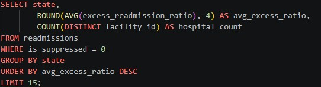
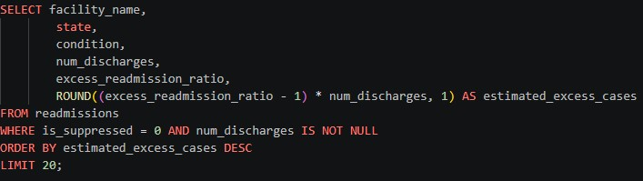
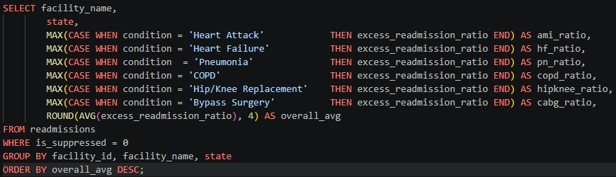
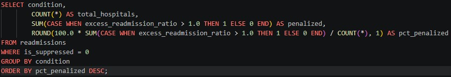
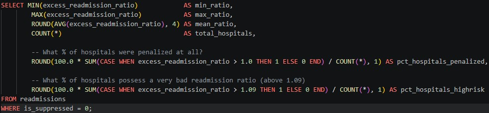
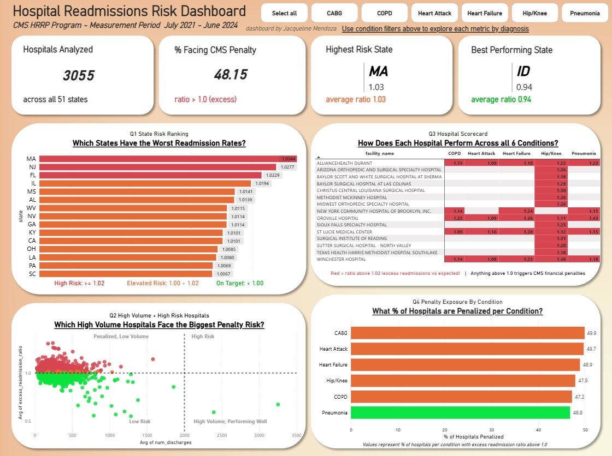

<h1>Hospital Readmissions Risk Analysis</h1>
CMS Hospital Readmissions Reduction Program (HRRP) - July 2021 through Jun 2024

--------------------------------------------------------------------------

<h2>Problem Statement:</h2>

In October 2012, the Centers for Medicare and Medicaid Services (CMS) launched the Hospital Readmissions Reduction Program (HRRP) which is a federal initiative that financially penalizes hospitals with excess 30-day readmission rates across six conditions. The conditions reported on where: Heart Attack (AMI), Heart Failure (HF), Pneumonia, COPD, Hip/Knee Replacement (THA/TKA), and Coronary Artery Bypass Graft Surgery (CABG). 

Hospital's performances are measured by Excess Readmission Ratio (ERR) which is the ratio of a hospital's predicted readmission rate to its expected rate based on national averages. Any ratio above 1.0 indicates more readmissions than expected thus triggering CMS financial penalties. 

This project analyzes the most recent HRRP dataset released to answer multiple core business questions that a hospital operations team, policy analyst, or healthcare consultant would actually need answered. 

--------------------------------------------------------------------------
**Pipeline**

**Raw Excel (data.cms.gov) -> Python (script/cleaning) -> SQLite (SQL analysis) -> Power BI (dashboard)**

--------------------------------------------------------------------------
**Dataset** - each row represents one hospital's performance on ONE condition. Hospitals with fewer than a minimum number of cases are suppressed by CMS and marked as "Too Few to Report"

| Attribute | Detail |
| --- | --- |
| Source | CMS Hospital Readmissions Reduction Program |
| Released | Feb. 25, 2026; Last modified: Jan. 26, 2026 |
| Measurement Period | July 1, 2021 - June 30, 2024 |
| Total Rows | 18,330 |
| Hospitals | 3,055 Unique Facilities |
| States | 51 (including DC) |
| Conditions Tracked | Heart Attack, Heart Failure, Pneumonia, COPD, Hip/Knee Replacement, Bypass Surgery (CABG) |

--------------------------------------------------------------------------
**Data Cleaning - Python**

The raw Excel file required several cleaning decisions before analysis. Some issues identified and resolved were:
- Number of Readmissions was a mixed-type column containing both numeric values and string values. Required converting to numeric with pd.to_numeric(errors='coerce'), in order to convert suppressed strings to NaN
- Approximately 6,600 rows had NULL values across ratio and rate columns due to low patient volume. Added a is_suppressed flag colum to preserve the rows for analysis instead of dropping them; filtered them from aggregations
- Measure Name used CMS coded values such as "READM-30-AMI-HRRP". Mapped the CMS coded values to human readable condition names for clearer analysis
- All column names were renamed to SQL friendly snake_case conditions

**Clean Script** : cms_clean_script.py: After cleaning, the dataset was loaded into a SQLite database (cms_readmissions.db) for SQL analysis

--------------------------------------------------------------------------
**SQL Business Questions** : cms_queries.sql

--
***Q1*** was focused on state risk rankings, asking which states have the worst readmission rates (can be toggled based on selected conditions) as operations or policy teams could possibly use this to prioritize where to focus statewide intervention resources.

***Findings:*** MA (1.0344) ranks as the highest risk state, followed by NJ (1.0277) and FL (1.0229). It is good to note that no state average exceeds 1.09 which is the individual hospital high risk threshold that indicates poor performance is concentrated in specific hospitals rather than being a uniform statewide problem. Taking from this, it might be suggested that targeted hospital level intervention is more effective than broad state policy. 

--
***Q2*** was focused on high volume and high risk combinations, asking which high volume hospitals face the biggest financial penalty exposure. As CMS penalties scale with patient volume, a hospital with 1,000 excess readmissions face far greater financial impact than one with 50.

***Findings:*** The scatter plot with detailed quadrant markers, revealed that most penalized hospitals were low volume facilities. High volume hospitals (>2000 discharges) with ratios above 1.0 represented the highest total financial penalty exposure as these institutions were the ones CMS penalties hit hardest in dollar terms.

--
***Q3*** was focused on hospital's scorecards, essentially asking how does each hospital perform across all 6 conditions. A hospital administrator or consulting team could use this to identify which specific conditions were driving a hospital's overall penalty status.

***Findings:*** The top 15 worst performing hospitals by average ratio of excess readmissions are predominantly surgical specialty hospitals. These are hospitals that are orthopedic or surgical centers possessing high Hip/Knee Replacement ratios and blank cells across other conditions. Reflecting their narrow patient population, CMS suppresses conditions where the volume is too low to report which was common amongst specialty facilities. Winchester Hospital (MA) stands out as a general hospital with elevated ratios across COPD, Heart Attack, Heart Failure, Hip/Knee, and Pneumonia simultaneously.

--
***Q4*** was benchmarking penalty exposure by condition, asking what percent of hospitals were penalized per condition. Benchmarking allows us to see how widespread the penalty problem was across each condition cateogry.

***Findings:*** The penalty rates are remarkably consistent across all six conditions with numbers ranging from 46.8% (Pneumonia) to 49.9% (CABG). No single condition dominated the penalty pciture which suggests excess readmissions are a systemic issue across US hopsitals instead of a condition specific problem. Solutions likely require broader operational and discharge planning improvements rather than condition specific clinical interventions.

--
***Distribution Analysis*** - setting risk thresholds. Before building the dashboard we need to perform a statistical analysis to establish data-driven thresholds rather than arbitrary cutoffs.

 

The 1.09 threshold for high risk corresponds to the 90th percentile of hospital ratios and approximately 1 standard deviation above the mean making it statistically and practically meaningful (not arbitrary).

| Metric | Value |
| --- | --- |
| Min ratio | 0.4689 |
| Max ratio | 1.6297 |
| Mean ratio | 1.0018 |
| % penalized (ratio > 1.0) | 48.1% |
| % high risk (ratio > 1.09) | 10.4% |

--------------------------------------------------------------------------
***Key Findings:***
- Nearly 1 in 2 US hospitals (48.1%) are currently being penalized by CMS for excess readmissions across at least one condition  
- 10.4% of hospitals are high risk (ratio > 1.09) with the top 10th percentile being where CMS penalties are most severe  
- MA is the highest risk state (avg ratio 1.0344) and Idaho is the best performing state (avg ratio 0.9432)  
- No state average exceeded 1.09 which indicates the real risk is concentrated at the individual hospital level making state-level policy alone insufficient  
- Penalty rates are nearly identical across all six conditions (46.8% - 49.9%) which points to systemic operational issues rather than condition specific clinical failures  
- Specialty surgical hospitals dominated the worst performing hospital list, driven almost entirely by one condition. Hip/Knee Replacement ratios were the constant driver, making it a finding that would significantly change how a consulting team could frame its intervention recommendations  
--------------------------------------------------------------------------
**Dashboard - Power BI**

The interactive dashboard built in Power BI allows stakeholders to filter all four visuals simultaneously by condition(s) using the slicer buttons at the top. This enables condition specific analysis without building separate reports.

--------------------------------------------------------------------------
**Tools Used - Summary**
| Tool | Purpose |
| --- | --- |
| Excel | Raw data source (data.cms.gov) |
| Python (pandas) | Data cleaning, type conversion, null flagging, SQLite loading |
| SQLite / DB Browser | SQL query development and business analysis |
| Power BI Desktop | Interactive dashboard and data visualization |
| GitHub | Portfolio hosting and project documentation |

--------------------------------------------------------------------------
**Created by Jacqueline Mendoza - [linkedin.com/in/jcmendoza2] - 2026**